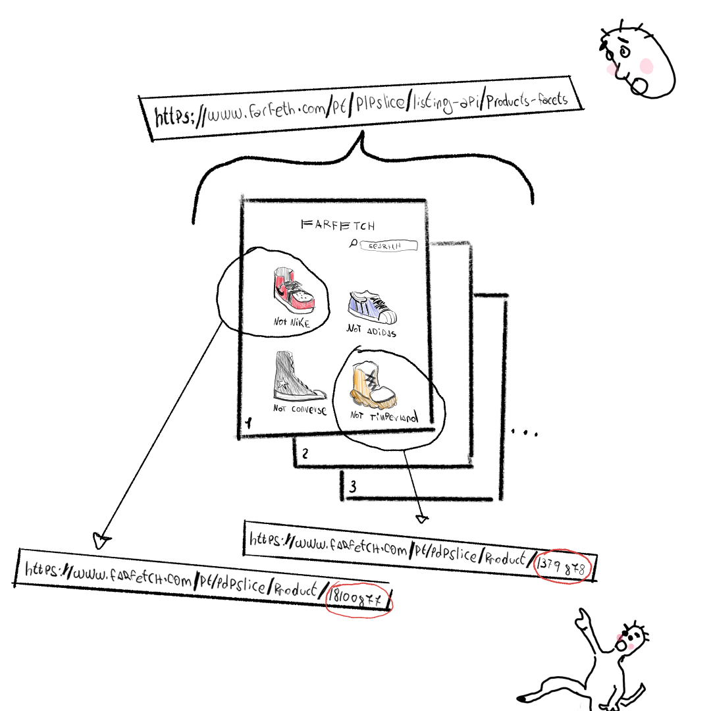

# Farfetch API!

Hello, this repo contains an API for fetching data from a fashion online store called Farfetch. For more information on the API itself checkout the documentation on the docs folder and for a nice demo checkout the video in the demo folder.
<br>
<br>

# Requirements
* python 3.9+
* windows 8+
* chrome or any other browser with developer options
<br>
<br>

# Setup

To use the API you will only need to install the following library (via command line):
 - requests-html
 ```
 pip install requests-html
 ```
But in case you want to run the costum script ("scrape_all_sneakers") I made that utilizes the api to scrape all the sneakers in the store, you will need to install the following libraries:
 - pandas
 ```
 pip install pandas
 ```
 - numpy
 ```
 pip install numpy
 ```

After thats done, you my friend, are ready to go!
<br>
<br>

# How the API fetches the data

To fetch the data its fairly easy, the API depends on two main links that I've stumbled upon while trying to create a strategy to scrape the website.
These two main links are:
* https://www.farfetch.com/pt/plpslice/listing-api/products-facets
* https://www.farfetch.com/pt/pdpslice/product/{product id}

The **first one of these links** returns a json with the data of a whole page (that contains 90 items) and we also can provide some arguments to the link, allowing us to filter the data that we dont want:

<pre>
https://www.farfetch.com/pt/plpslice/listing-api/products-facets<b>?page=2&view=90&sort=3&scale=282&category=137174&pagetype=Shopping&rootCategory=Men&pricetype=FullPrice&c-category=135968</b> 
</pre>

For more information about these arguments checkout the documentation. We will use the information that this link provides to colect all of the id's from our desired products and then substitute these id's on the **second link**. For example if we were to obtain a product with the id 18100877 then the link would look something like this:

<pre>
https://www.farfetch.com/pt/pdpslice/product/18100877
</pre>

This **second link** will provide the API with all the information (in json format) we need about the given product and thats it! Simple right?!

Here, take a look this beautiful hand drawn illustration I made to try to and help you visualize a little better all of this jargan you just read.



<br>
<br>

# How I scraped all of that data

Heres the deal, if you want to scrape HUGE amounts of data, you will need to do proxy rotation, because guess what? these websites wont let the same person send 10.000 requests in under 1 minute (I learnt this the hardway, got shadowbanned a couple of times by some websites). To implement proxy and header rotation its fairly easy, the problem lays in the fact that proxies are paid and since im a broke student I had to find an alternative.

After searching a little bit I quickly found out that there is actually some websites that provide free public proxies to everyone, but because they are public most of websites already blocked and a lot of people use it which makes them extremely slow and unreliable.

After some more researching though, I found this website that offers 1 private proxy thats available for 1 month and in which you can make at max 5000 requests (the website is called https://www.scraperapi.com/). So I basically created 30 accounts in that website, used all of the 30 proxies that they provided me (one per account) and then created that "scrape_all_sneakers" script.

<pre>
<b>note:</b> I wrote this a while ago so the proxies now (2022/05/25) are no longer working but I will try to create at least 4 more updated proxies because since im aplying to internships I belive some recruiters will try to test the code.
</pre>
That script runned nonstop during 4 days which provided me with information of around 21.000+ sneakers. I also found some headers on the internet that just to rotate them as well and simulate different browsers and a way of trying to not get caught.

<br>

#### Important points of the script:

* Each proxie will send one request to one url (different for each proxy) and then wait about 6 to 8 minutes in between the requests. This is what will allow us to not get banned.
* Not everything goes as planned, sometimes the request might not go through for reasons that are out of our control, so for that I included in the code, error treatmeant that saves all the urls that werent scraped into a file named "didnt_scrape.csv".